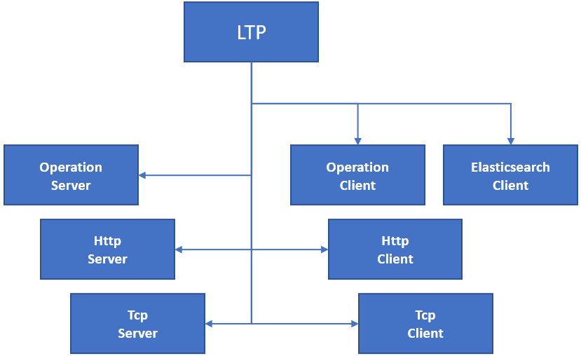

# LogicalTerminationPoint and LayerProtocol

The ControlConstruct comprises a list of LogicalTerminationPoints (LTP).  
The LTP class represents the termination point of a logical connection, means: it's some sort of interface.  
In case of applications, this includes details about the exposed and the consumed services.  
The attributes represented by an LTP depends on the type of connection terminated.  

Most relevant types of connections documented in the CONFIGfile of the applications:

  

The server interfaces provide information about the application itself:  
- The HttpServer provides the current application name, release number, owner, and the revision history. There will be only one HttpServer instance per application.  
- The TcpServer represents the current IPv4 address and port of the application. There will be at least one TcpServer instance per application. If application shall be reachable from within and outside the virtual privat cloud (name space behind TLS layer termination), two TcpServers are required for http and https.  
- Each service that is provided by the application is represented as an OperationServer in the list of LTPs. The OperationServer consists of the name, operation key to validate the authorization and the lifecycle state of the service.  

The client interfaces are documenting information about connections to other software components:  
- The OperationClient interface provides information about the consumed services. The major property of this interface is the name of the consumed service and the operation key that is used for authorization purposes.  
- The ElasticsearchClient allows configuring the connection towards a database that is storing ApplicationData.  
- The HttpClient represents the details of a client application whose APIs are consumed. HttpClient acts as a server to the OperationClient. There is an one-to-many mapping between HttpClient to OperationClient.  
- The TcpClient stores information about the IPv4 address and port at which a serving application can be reached. There is a one-to-one mapping between a HttpClient and a TcpClient.  

Each LTP is identified by an ID (UUID), which is unique within the entire MW SDN architecture.  
Exact details on the format of UUIDs can be found in [Structure of UUIDs](../../Names/StructureOfUuids/StructureOfUuids.md).  
The clients/server relationships between the Tcp, Http and Operation LTPs are expressed by the “ClientLtp” and “ServerLtp” properties that are containing references (UUIDs) to other LTPs.  

  
