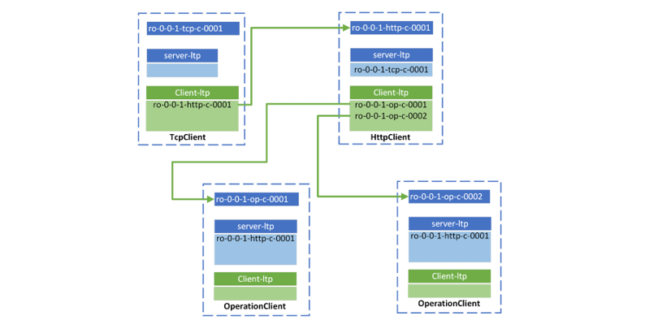

# LogicalTerminationPoint

ControlConstructs consist of a list of LogicalTerminationPoints (LTP).  
The LTP class represents the termination point of a connection, means: interface.  
In case of applications, this includes details about the exposed and the consumed services.  
The attributes represented by an LTP depends on the type of connection terminated.  

Most relevant types of connections documented in the CONFIGfile of the applications:

  

The server interfaces provide information about the application itself:  
- The HttpServer provides the current application name, release number, owner, and the revision history. There will be only one HttpServer instance per application.  
- The TcpServer represents the current IPv4 address and port of the application. There will be only one TcpServer instance per application.  
- The services exposed by the application will be represented as OperationServer. If a application exposes four services, then for each service, there will be a OperationServer instance available in the LTP list. The OperationServer consists of the name, operation key to validate the authorization and the lifecycle state of the service.  

The client interfaces provide information about the consumed services, their application and transport details:  
- The OperationClient interface provides information about the consumed services. The major property of this interface is the name of the consumed service and the operation key using which we can authorize the service.  
- The HttpClient represents the details of a client application whose APIs are consumed. HttpClient acts as a server to the OperationClient. There is a one-to-many mapping between HttpClient to OperationClient.  
- The TcpClient stores information about the IPv4 address and port at which a serving application can be reached. There is a one-to-one mapping between a HttpClient and a TcpClient.  

Each LTP is identified by a unique ID (UUID).  
Exact details on the format of UUIDs can be found in [Structure of UUIDs](../../Names/StructureOfUuids/StructureOfUuids.md).  
The clients/server relationships between the Tcp, Http and Operation LTPs are expressed by the “ClientLtp” and “ServerLtp” properties.  
The “ClientLtp” and “ServerLtp” properties are containing the UUIDs of the respective client or server LTPs.  

  
