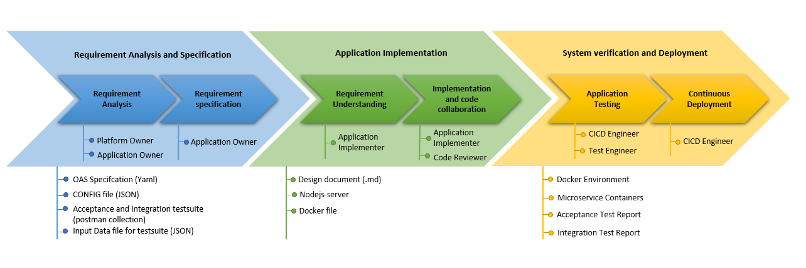
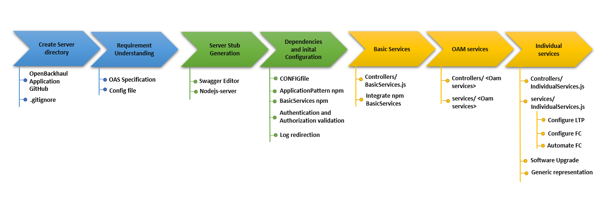

# Implementing Applications

The ultimate goal is to build an application layer on top of the SDN controller(s) based on the Microservice principles. The whole idea came out of the ONF openBackhaul program with a clear perspective to provide solution for a variety of use cases in the existing network environment.

Each microservice in our application layer,
* is developed based on the API first approach,
* have its own database, modelled based on the ONF core model concepts
* is a modular REST server designed for a single use-case
* is capable of communicating with other Microservices in the architecture,
* is loosely coupled and independently deployable components
* is highly maintainable and testable

Since we are following an API first approach , an application owner will analyze a new business requirement and specify the application in OAS3.0 along with the initial load file. A developer can also be expected to engage in the specification phase to review and provide suggestion to refine the specification.

   

A developer can start working on the implementation after receiving the Open API specification from the ApplicationOwner. In general , the following sequence of activities are recommended :

   

## Repository
Each application has its own repository where the open API specification and CONFIGFile for that particular application is available. And application implementors should also integrate server-side implementation into the same repository and collaborate. 

**concept**
* [Directory for server-side implementation](./ImplementingApplication/ConceptOfDirectoryForServer/ConceptOfDirectoryForServer.md)
* [.gitignore file](./ImplementingApplication/ConceptOfGitIgnoreFile/ConceptOfGitIgnoreFile.md)

**Step-by-Step Guidelines**
* [Create Directory for server-side implementation](./ImplementingApplication/Steps2CreateDirectoryForServer/Steps2CreateDirectoryForServer.md)
* [Create .gitignore file](./ImplementingApplication/Steps2CreateGitIgnoreFile/Steps2CreateGitIgnoreFile.md)

## Understand the requirement

To understand the requirement, it is necessary to know in advance the application pattern specific concepts, based on which the load file and the Open API specification is modelled.

**Concepts**
* [Understanding the CONFIG file](./ImplementingApplication/ConceptOfUnderstandingTheConfigFile/ConceptOfUnderstandingTheConfigFile.md)
* [Understanding the OAS](./ImplementingApplication/ConceptOfUnderstandingTheOAS/ConceptOfUnderstandingTheOAS.md)

**Step-by-Step Guidelines**
* [How to get a high-level overview](./ImplementingApplication/Steps2GetHighLevelOverview/Steps2GetHighLevelOverview.md)

## Server stub generation 

The server-side code is generated from the API specification

**Step-by-Step Guidelines**
* [Server stub generation](./ImplementingApplication/Steps2GenerateServerStub/Steps2GenerateServerStub.md)

## Dependencies and Initial Configuration

In the generated server side stub , initial dependencies and setup needs to be configured.

**Concepts**
* [Integrating Configuration file](./ImplementingApplication/ConceptOfIntegratingConfigFile/ConceptOfIntegratingConfigFile.md)
* [Application pattern package](./ImplementingApplication/ConceptOfApplicationPatternPackage/ConceptOfApplicationPatternPackage.md)
* [old reference -> Modules of the ApplicationPattern Implementation](./ApplicationPatternDocumentation/ApplicationPatternDocumentation.md)
* [Authorization](./ImplementingApplication/ConceptOfAuthenticationAuthorization/ConceptOfAuthenticationAuthorization.md)
* [Directing Logs and Traces](./ImplementingApplication/ConceptOfLogDirection/ConceptOfLogDirection.md)

**Step-by-Step Guidelines**
* [Integrate Configuration file](./ImplementingApplication/Steps2IntegrateConfigFile/Steps2IntegrateConfigFile.md)
* [Integrate Application pattern package](./ImplementingApplication/Steps2IntegrateApplicationPatternPackage/Steps2IntegrateApplicationPatternPackage.md)
* [Integrating Authorization](./ImplementingApplication/Steps2SupportAuthenticationAuthorization/Steps2SupportAuthenticationAuthorization.md)
* [Integrate Logging Application](./ImplementingApplication/Steps2IntegrateLoggingApplication/Steps2IntegrateLoggingApplication.md)

## Basic Service

Basic service implementations are available in the `BasicServices` npm package. The implementations in the 

**Concepts**
* [Basic services package](./ImplementingApplication/ConceptOfBasicServices/ConceptOfBasicServices.md)
  
**Step-by-Step Guidelines**
* [Integrate Basic services package](./ImplementingApplication/Steps2IntegrateBasicServicesPackage/Steps2IntegrateBasicServicesPackage.md)
* [Integrate Basic services](./ImplementingApplication/Steps2IntegrateBasicServices/Steps2IntegrateBasicServices.md)
  
## OAM Services

OAM service implementation should be done by manipulating the CONFIG file.

**Concepts**
* [OAM services](./ImplementingApplication/ConceptOfOAMServices/ConceptOfOAMServices.md)
  
**Step-by-Step Guidelines**
* [Implementing OAM services](./ImplementingApplication/Steps2ImplementOAMServices/Steps2ImplementOAMServices.md)

## Individual Services

Individual service implementation should be done by based on the specified requirement.

**Concepts**
* [Individual services](./ImplementingApplication/ConceptOfIndividualServices/ConceptOfIndividualServices.md)
* [Software upgradation](./ImplementingApplication/ConceptOfSoftwareUpgradation/ConceptOfSoftwareUpgradation.md)
* [Generic Representation](./ImplementingApplication/ConceptOfGenericRepresentation/ConceptOfGenericRepresentation.md)
  
**Step-by-Step Guidelines**
* [Implementing Individual services](./ImplementingApplication/Steps2ImplementIndividualServices/Steps2ImplementIndividualServices.md)  

[<- Back to Introduction](../ImplementingApplication/Introduction/Introduction.md) - - - [Up to Main](../ImplementingApplication/Main.md) - - - [Ahead to Specifying ->](../ImplementingApplication/SpecifyingApplications/SpecifyingApplications.md)

