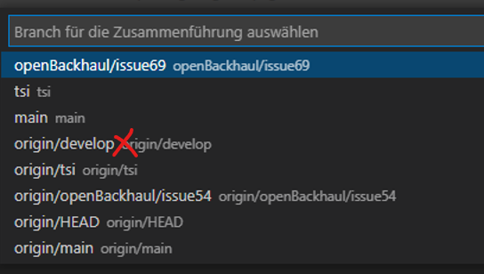
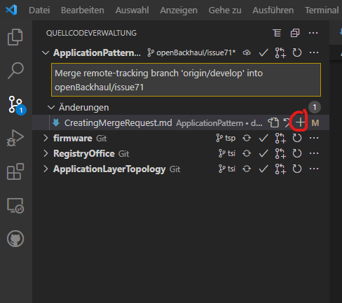
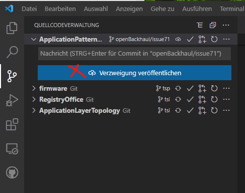
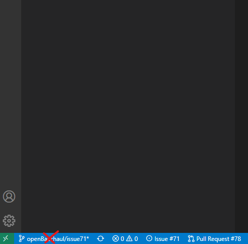
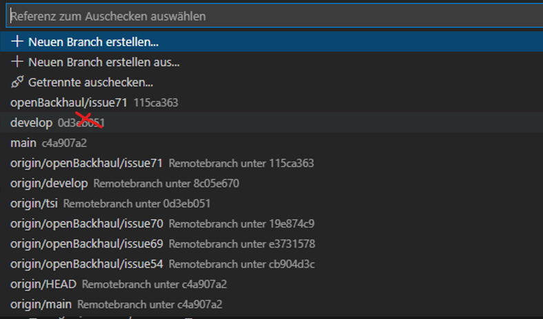

# Completing an Issue and creating a Merge Request

After _committing_ all changes, which are necessary to complete the _Issue_, into the local _feature branch_ it is time for consolidating your contribution into the public _develop_ branch (_origin/develop branch_).

For contributing your work, click on the source control symbol (the branch icon in the menu bar to the left).  

In a first phase of the process, you have to assure that your contribution is not creating any conflicts while _merging_ into the public _develop branch_ (_origin/develop branch_).  
For this purpose, you have to _merge_ the _origin/develop branch_ into your local _feature branch_. (Please, be aware that this is the opposite direction from the actually intended.)  

* Open the menu at the repository, which you would like to contribute to, click on "Branch zusammenführen"...  

* ... and chose the _origin/develop branch_ from the list.  

* If there would be any _merge conflicts_, they would show up now.
* After analyzing two conflicting versions of the code, you could decide for the versions (current, incoming or both) to become part of your local _feature branch_.  

* Save the files, which got changed during resolving all conflicts by Ctrl+s and _stage_ them for being _committed_ during the _merge_ of the _origin/develop branch_ into your local _feature branch_.  

* Confirm the _merge_ of the _origin/develop branch_ into your local _feature branch_ ...  

* ... and _push_ your local _feature branch_ with the resolved conflicts to the remote repository (creates or updates remote _feature branch_).  

In the second phase of the process, you have to create the _Merge Request_ for consolidating the remote copy of your _feature branch_, which is now cleared from conflicts, into the _origin/develop branch_.  

* Click on the pull request icon at the repository you would like to change.  

* VSCode is now automatically filling the source and target branch into a form and you just have to double check.  
Please, add a _Merge Request_ message, which is complying the chapter about [Formulating Merge Request Messages](../FormulatingCommitMessages/FormulatingCommitMessages.md) and click Create.  

* Alike in the following picture, the _Merge Request_ does not create any conflicts and can directly be _merged_ after reviewing the changes. As you can see, the _Merge Request_ is not involving your local repository. The _Merge_ is happening exclusively in the remote repository on GitHub. 

* At least the originator of the _Issue_, which is underlying the branch that is now requested to be merged, should be marked as a Reviewer.  

* The _Merge Request_ should be assigned to the assignee of the underlying _Issue_, because the assignee of the _Issue_ should be the person, who merges the results into the _origin/develop branch_ and deletes the _feature branch_.  

In the third phase of the process, it is recommended to immediately clean up your local repository.  
Your local _feature branch_ has been copied to the remote repository. So your data is save.  
After successfully _merging_ into the _origin/develop branch_, the remote _feature branch_ will be automatically(!) deleted, but your local copy is disconnected from further proceeding.  
For avoiding accumulating useless branches in your local repository, it is recommended to delete the local _feature branch_ right after formulating the _Merge Request_.  

* For deleting the obsolete _feature branch_, you have to leave it first.  
So open the list of branches ...  

* ... and chose the _develop branch_ from the list.

* Open the menu at the repository, which you would like to clean up, click on "Branch löschen"...  

* ... and chose the obsolete _feature branch_ from the list.

After conducting the _merge_  
* the _Issue_, which initiated creation of the _feature branch_, will be closed
* and the remote copy of the _feature branch_ will be automatically(!) deleted.

[<- Back to Creating a Commit](../CreatingCommit/CreatingCommit.md) - - - [Up to Preparing for Specifying Applications](../PreparingSpecifying.md)
