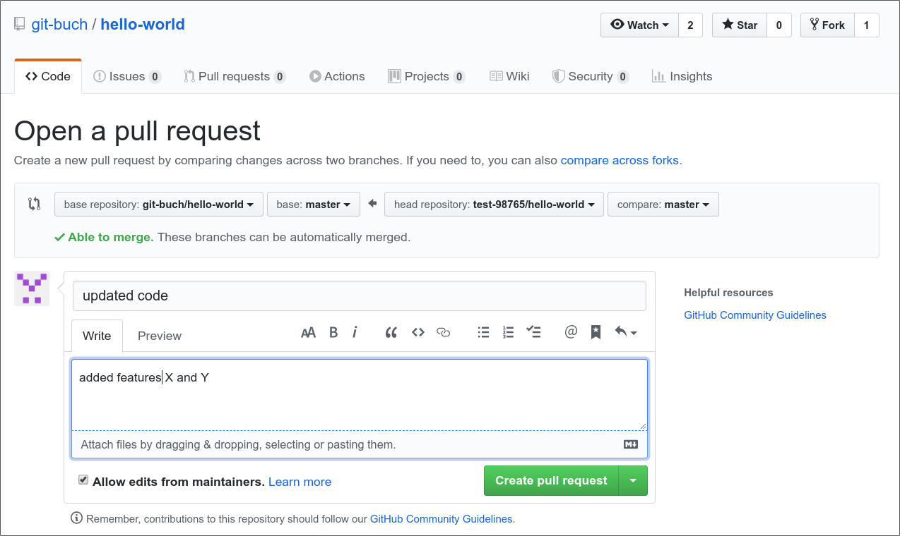

# Forking Workflow

This process applies for contributing to a specification, which you do not own (not being assigned Collaborator), or any other open source project.

### First Fork, ...

* Navigate to GitHub repository you would like to contribute and there press the _Fork_ button
* By forking you will create a copy of the application's repository inside your own GitHub account
* Next you can create a local repository on your laptop from the copy via git clone, e.g. from within VSCode
* There you should follow the same rules as with the GitFlow workflow while applying the desired changes and committing them
* If your changes are completed, they can be sychronised to your own GitHub fork (i.e. your copy of the original repository) by using git push, e.g. from within VSCode

### ... then Merge Request

* Inside your own fork on the GitHub web gui there is a tab called "Pull requests"; it contains the button *New pull request*; pushing it will redirect you to the page of the original project  
    

* The GitHub gui first shows a summary of the applied changes
* In the next step you will send a message to the ApplicationOwner of the original repository; please apply the [rules for commit and merge request messages](../FormulatingCommitMessages/FormulatingCommitMessages.md)
* By pressing _Create pull request_ the operation is finished.  
    

* The ApplicationOwner is now in charge of accepting your contribution (_Merge pull request_), declining it or suggesting improvals and asking you for further information or changes (_Comment_)

Pull requests are the only way to participate in GitHub projects even without being a member of the actual development team.  
We are using them to prevent uncoordinated changes to the repository.

Note that forks and pull requests are not Git techniques.  
Therefore, no git sub-commands exist.  
You rather have to conduct these operations inside the web gui of your Git plattform.
If VSCode is used, a special plugin can be used - [see here](../VSCode2GitHub/VSCode2GitHub.md) for instructions).  
The nomenclature can be different across various plattforms. 
e.g. "Pull request" on GitHub is equivalent with "Merge request" on GitLab.

Source: 
_Git - Projektverwaltung für Entwickler und DevOps-Teams_  
Bernd Öggl und Michael Kofler  
Rheinwerk Verlag

[Up to Preparing](../PreparingSpecifying.md)
