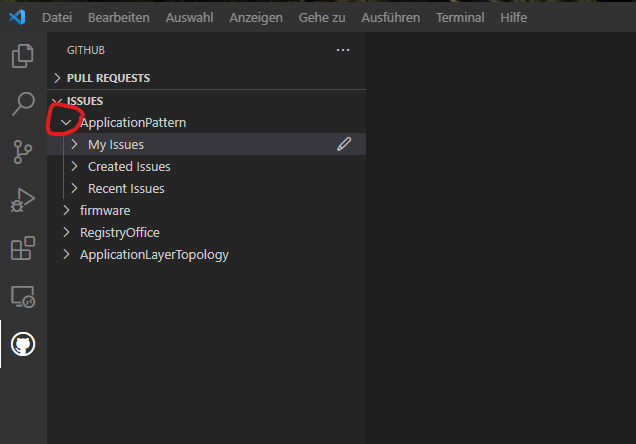
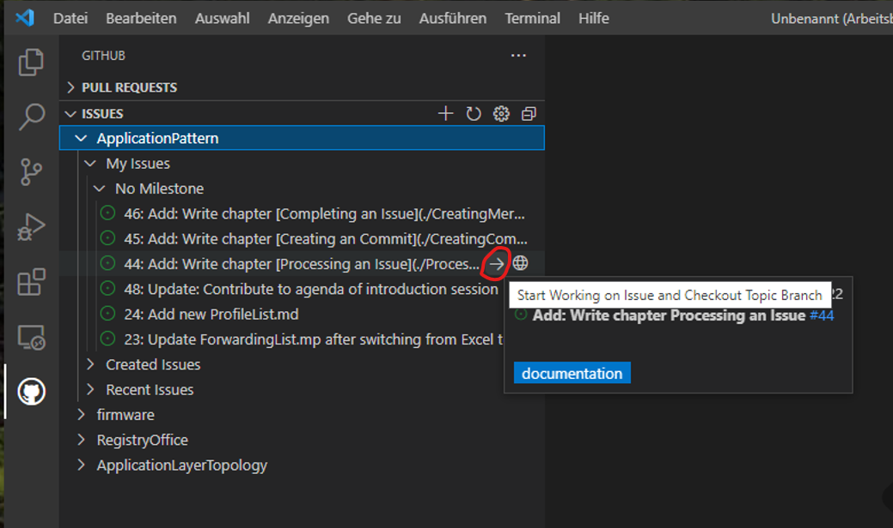
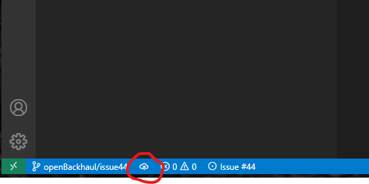
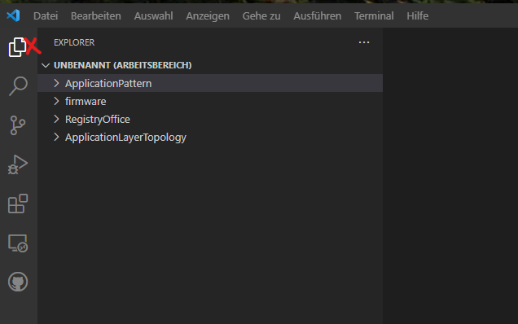

# Processing an Issue

Click on the GitHub symbol to the left of the VSCode window.  

  

Expand the list of _Issues_ by clicking the arrow besides "ISSUES".  

  

Update the list of _Issues_ by clicking the circle arrow.  

  

Expand the repository, which shall be processed.  

  

If the _Issue_ has been assigned to you, you will find it in "My Issues".  
Otherwise, check "Created Issues", if you created the _Issue_ by yourself, but forgot to assign it to yourself.  

  

Find the _Issue_, which you would like to process, and click the arrow to the right for starting to work on the _Issue_. 

  

Now, the _Issue_ is marked to be in grogress.  

  

Attention! During the latest step, a new branch has been created locally and VSCode automatically switched its view into this branch.  

  

It is recommended to click the cloud symbol for publishing the new branch on the remote GitHub for indicating that work on this _Issue_ is on-going.  

  

Click on the Explorer symbol for starting to be productive in the new branch.  

  

Of course, your actual doing should now exclusively relate to the chosen _Issue_ until you committed into the branch, which has been created for that purpose.  

  

See [Creating a Commit](../CreatingCommit/CreatingCommit.md) and [Creating a Merge Request](../CreatingMergeRequest/CreatingMergeRequest.md) for consequent steps.
