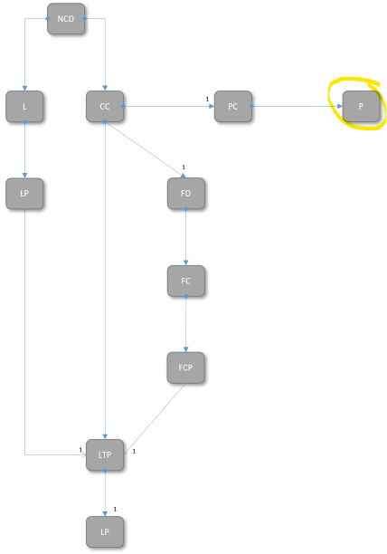

# Structure of Profiles

### Purpose of Profiles  
Profiles are data structures for holding information that is not directly connected with an individual interface.  
Contained information could relate e.g.  
* to all or a group of interfaces  
* or to a process or calculation that is executed inside the application.  

Profiles are for holding configuration information (which is different from application data).  
While data is entering the application through body or response body of some service, configuration information is read and set through GET and PUT requests in the OaM section of the REST API.  

### Structure of Profiles  
Every definition of a Profile has to contain:  
* ProfileName for identifying the kind of Profile  
* UUID for identifying the instance of Profile  
* Set of additional attributes that are specific to the individual kind of Profile  

Its independence from individual interfaces is also obvious from the core information model and the Profile class being separated from the LogicalTerminationPoint, respectively the LayerProtocol.  
  

**ProfileName**  
The name of the Profile must describe the data object in one or two meaningful nouns followed by "Profile".  
The name must be written in UpperCamelCase and it must be unique within the scope of the individual application.  

**UUIDs**  
UUIDs of Profiles have to comply with the rules defined in [Structure of UUIDs](../StructureOfUuids/StructureOfUuids.md).  

**Additional Attributes**  
The ApplicationOwner is free to define a set of additional attributes.  
It is recommended to check, whether one of the [already existing Profiles](../ProfileLibrary/ProfileLibrary.md) fulfils the needs, and to re-use whenever possible.  

### Re-use of Profiles

Re-using already existing Profile definitions is very much recommended.  
The templates of the ProfileList and the ProfileInstanceList already contain the following definitions.

**IntegerProfile**
The IntegerProfile is for storing a single Integer value.  
It has been used for several times in multiple applications.  
E.g. it is holding the configuration of the number of records to be stored in the ExecutionAndTraceLog application.  

**StringProfile**
The StringProfile is for storing a single String value.  
It has been used in multiple applications.  
E.g. it is holding the operational mode of the OperationKeyManagement application.  

**ActionProfile**  
The ActionProfile is the by far most often used Profile.  
It is describing the label of a button that shall be shown in a generic presentation and the request, which is to be sent, in case the button has been pushed.  
It has been used for several times in all existing applications.  