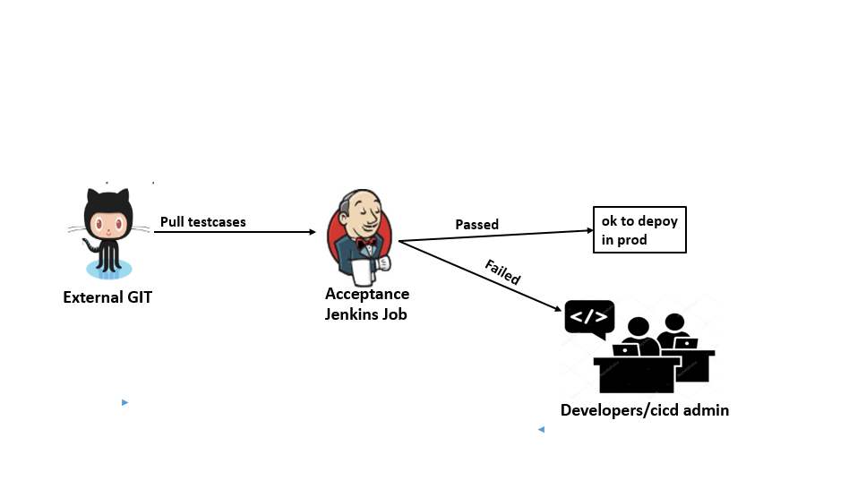

### Acceptance Testing
Once Application deployed and automatically acceptance testing performed on test server.

As a prerequisite, the related test tools mentioned earlier to be installed and set up the server.

Below is the overview of workflow

* GIT is a version control system which holds the source code of applications and automated testsuites.
* Developers can develop the source code and test suites and pushed to github.
* Jenkins has acceptance job created by user with all configuration and run collects the test results.
* If no failures seen promoted the build to production, failures seen then informed to developers for fixing the issues.

### Procedure for automated testing

#### Configure Pipeline job for running Acceptance test cases

Please refer the previous section for [creating the jenkins job](../Tools/Jenkins/JenkinsJobsAndSDNDeployment.md#list-of-jenkins-jobs)

### Build the declarative pipeline script
Once job is created, please follow the below procedure to build the groovy script for testing.

        pipeline {
    agent {
        label 'test_server'
    }
    stages {
      stage ('source stage') {
           steps {
                git branch: 'develop', url: '<github repository link>' 
             }
            }
        }
        stage ('Setup to run testsuite collections') {
            steps {
                 dir ('/var/lib/jenkins/workspace')
                    {
                        <Update the configuration according to testing requirements in input file of applications>

                }
            }
        }
        stage ('run Acceptance test cases using newman') {
            steps {

                 dir ('/var/lib/jenkins/workspace/<jobworkspace>/')
                    {
                    
                   sh 'newman run <collectionfile> -d <inputfile> -r htmlextra,cli --reporter-htmlextra-logs'
                }
            }
        }  
        stage ('Print test results in workspace dir.') {
            steps {

                 dir ('/var/lib/jenkins/workspace/<jobname>/newman')
                    {
                    sh 'ls -lrt'
                }
            }
        }
    }

    }
    

#### Source stage 
Clone the current testsuite repository from the github though jenkins.
     
#### Setup to run testsuite collections 
- Update the file <inputfile.date.time+data.no.json> with "typeOfTesting": "Acceptance"
- Update <inputfile.date.time+data.no.json> file with proper "userName" and "authorizationCode" to access the applications from Jenkins
- Update <inputfile.date.time+data.no.json> file with "serverUrl" with current URL of application where it is up and running
-  Finally, makesure that the application loadfile properly updated with latest data (Ip address and Ports of applications in database).

#### Run Acceptance test cases using newman
To run the suite, we are using below command.

 newman run <postmancollectionjsonfile> -d <inputfile.date.time+data.no.json> -r htmlextra,cli --reporter-htmlextra-logs

        Example command used for RO suite: newman run RegistryOffice_0.0.1_tsi.date.time+testcases.1.postman_collection -d RegistryOffice_0.0.1_tsi.date.time+data.no.json -r htmlextra,cli --reporter-htmlextra-logs

### Results available

As part of pipeline configuration setup and running the test suites and also configure respective suite workspace. Means after executing the suites, the results are available in this workspace which is a server path **/var/lib/jenkins/workspace/< suitename>/newman**

    Example path for RO suite and collected results :

    on server: /var/lib/jenkins/workspace/RO_Testcases/newman

    url to access the job: http://10.0.3.4:1234/view/Applications/job/Registry_Office/2/

[<- Back to main Testing Applications ->](../../TestingApplications.md)