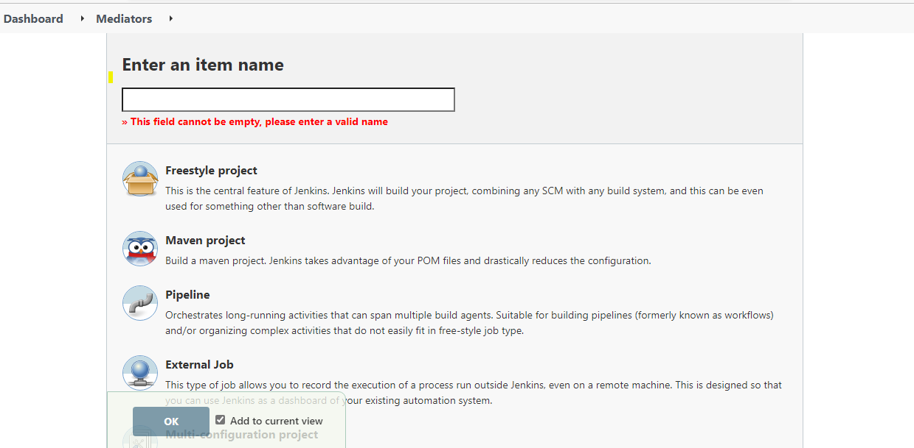

### Application Deployment in Test Bed

#### Automated Pipeline Steps
- Create pipeline jobs with required configuration
- Pipeline Stages 
- CI/CD Pipeline Flow
- Declarative pipeline script
- Verify the applications are up and running
- Run the Automation testsuites
 
#### Create pipeline jobs with all necessary configurations
- Goto DashBoard and select and create new item with pipeline job
- Once job created and Configure the job with all details that required like PollSCM time interval to perform monitoring the pipeline 
- Then develop and add the pipeline script to current pipeline job
- Apply and save the configurations

#### Pipeline Stages
- Source stage 
- Docker build stage 
- Publish Docker image 
- Deploy application as a container.(TestLab) 
- Save docker image in local server.
- Testing stage(Acceptance tests in TestLab and Integration tests in Production) 
- Approve build for production if everything ok in testing stage 

#### CI/CD Pipeline Flow
   

#### Automated pipeline scripts

Follow all stages like clone, build, deploy and test the applications in Testbed.  Once everything is fine, we will save the docker images as tar file in WebApp server.

Pipeline Configuration : 
        
    pipeline {
      stage ('source stage') - clone the repository in this stage
      stage ('setup and image build') - clean the old container and build new image
      stage('Run Docker container') - expose the port and run the container from image
      stage('save Docker image') - save the docker images
    }
    
#### Verify the applications are up and running
Once Applications(ex: RO,TAR,EATL etc) deployed using the dockerize containers, Go to the browser and check the Ip address with port XXXx which exposed in docker file. Verify whether application swagger is up and running.

    http://<serverIp>:<port>/docs/
    ex: http://125.4.5.11:1234/docs/

 
#### Run the Automation Testsuites 
Automation testsuites running once after the application deployment.
- #### [Acceptance Testing](../../AcceptanceTesting/Overview/pipelineconfiguration.md)

#### Email Notification
Once test suite execution is completed, The notification with execution reports and job URL's sent to developers and CICD team.

[<- Back to Testing Applications](../../../TestingApplications.md) - - - [Ahead to SDNApplicationDeploymentInProduction](../SDNApplicationPatternDeployment/AppDeploymentInProd.md)