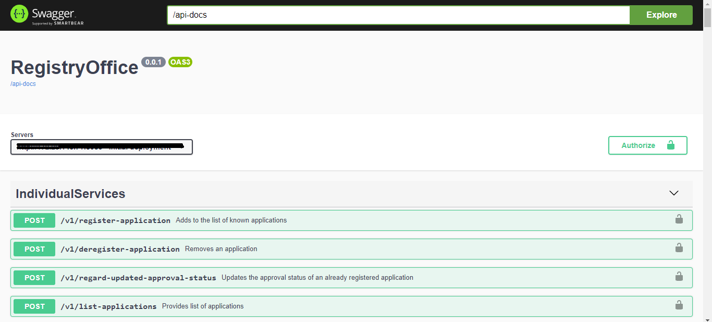

### Application Deployment in Test Bed

This section tells how to deploy application through jenkins automation using docker framework. 

Below are procedure to create the automation job in testbed.

#### Automated Pipeline Steps
- Pipeline job creation
- Build the declarative pipeline script
- Verify the applications are up and running
- Run the Automation testsuites
 
### Create pipeline jobs with all necessary configurations

[Please refer the previous section for creating the jenkins job](../Tools/Jenkins/JenkinsJobsAndSDNDeployment.md#list-of-jenkins-jobs)

### Declarative pipeline script
To automated script, currently used the groovy scripting and docker commands and few shell commands executed.

Below are the stages executed:

- Source stage where takes the clone of source code from github as local repository
- Docker build stage which cleans the old image data and build the new image
- Deploy application image as a container
- Save docker image as tar file in local server.
- Execute automated acceptance testsuites and collects html test reports by test server.
- Approve build for production if everything ok in testing

Follow all stages like clone, build, deploy and test the applications in Testbed.  Once everything is fine, we will save the docker images as tar file in WebApp server.

Pipeline Configuration : 
        
    pipeline {
      agent {
        label 'WebApp'
      }
      stages {
        stage ('source stage') {
           git branch: 'develop', url: 'https://github.com/openBackhaul/RegistryOffice.git'
       }
      stage ('setup and image build') {
        steps {
          <execute the FakeToOriginalIPConverter script for changing the application default ip address to actual ip address >
          sh 'docker build -t <imagename> .'
          sh 'docker volume create <volumename>'
          .....
        }
      }
      stage('Run Docker container') {
        steps {
        sh 'docker run -d -p XXXX:XXXX --name <containername> -v <volumename>:<path of the volumetobecreated> <imagename>'
        sh 'docker ps -a'
      }
       }
      stage('save Docker image') {
        steps{
                sh 'docker save -o /home/WebApp/gitlab_stage/docker-images-list/RO/cicd_user-registry-office-v2-$(date +%Y-%m-%d-%H:%M:%S).tar cicd_user/registry-office-v2'
                }
            }
        }
    }
  
**Note** : above provided sample script code is just an example, based on requirements user can develop his own groovy script/shell script.
    
#### Verify the applications are up and running
Once Applications(ex: RO,TAR,EATL etc) deployed as containers, Go to the browser and check the Ip address with port XXXX which exposed in docker file is accessible or not. if it accessible then application swagger started up and running.

Below is the format for the swagger created for application pattern applications.

    http://<serverIp>:<port>/docs/
Below is the example of RegistryOffice application which deployed on testbed already and attached the picture.

    http://125.4.5.11:1234/docs/

 

### Run the Automation Testsuites 
Automation testsuites running once after the application deployment is done. The testing will performed on testserver as mentioned earlier.

- #### [Acceptance testing procedure](../../AcceptanceTesting/Overview/pipelineconfiguration.md)

[<-Back to Workflow](./WorkFlow.md) - - - [Back to main Testing Applications](../../TestingApplications.md) - - - [Ahead to SDNApplicationDeploymentInProduction](../SDNApplicationPatternDeployment/AppDeploymentInProd.md)