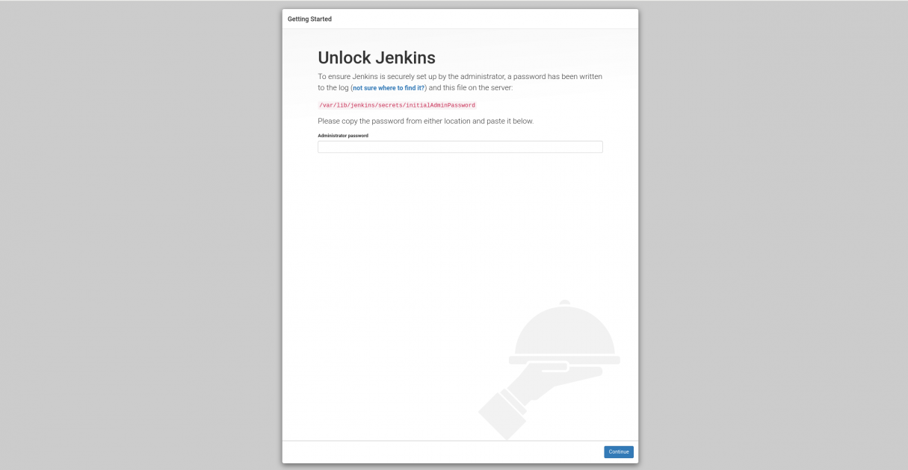

## Environment SetUp
Once Jenkins is up and running, let’s adjust our firewall rules so that we can reach it from a web browser to complete the initial setup. 

### Enabled firewall support for XXXX(default 8080) port

Now Jenkins is up and running on XXXX port.

    Firewall-cmd - -list-all
    Firewall-cmd - -add-port=XXXX/tcp - -permanent

Once we done the installation and firewall setup, the Jenkins is running on  
    
    http:<server-Ip>:<port>

**Unlock Jenkins** :

Once opened the URL, which displays the location of the initial password on unlock screen and enter the password key from /var/lib/jenkins/secrets/initialAdminPassword file. You can access Jenkins by providing the password after reading the file. 

**Image**

The next screen presents the option of installing suggested plugins or selecting specific plugins then go ahead with suggested plugins.

Wait for sometime to install and setup the Jenkins environment with suggested plugin's. Create an admin user. Make sure you remember the username and password, as they are the credentials for accessing the Jenkins WebUI. 

specify if you wish to change the port for Jenkins or else continue with the default port. 

 
Jenkins setup is complete and it can be accessed with the URL that is configured for it. 
Then click on the **start Using Jenkins** to open the Jenkins Dashboard. 

[<-Back to Environment SetUp](./EnvironmentSetup.md) - - - [Back to main TestingApplications](../../../TestingApplications.md) - - - [a head to PluginInstallation ->](./PluginInstallation.md)