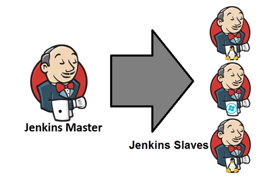
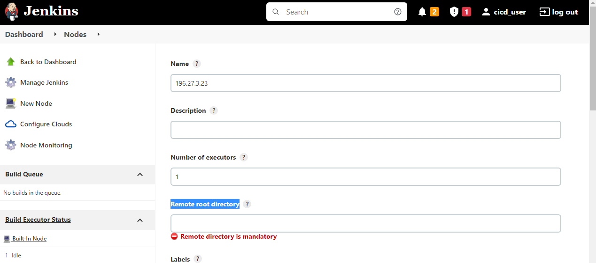
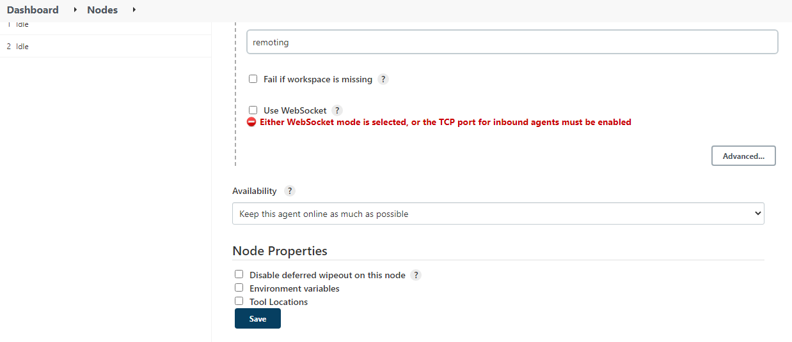

### Configure master-slave configuration for deploying application 

**The Jenkins master** simple machine where Jenkins is running and acts to scheduling the jobs, assign slaves, and send builds to slaves to execute the jobs. It will also monitor the slave state (offline or online) and get back the build result responses from slaves and the display build results on the console output. 

**Jenkins slaves** takes the instructions/commands from master and execute the jobs.

To configure the slave nodes, Open Jenkins Dashboard=>Click on Manage Jenkins=>Click on Manage Nodes and Clouds=>New node.

Enter the Nodename and select create.
 

 Once click on create, it prompts below screen, In that we have to enter the details like nodename, Remote root directory etc.
 
 
Based on our requirement add the data and save the configuration as below.

Once configured the server with node details and home directory updated for all required nodes then the complete set up is ready in current SDN controller application testing.

[<-Back to PluginInstallation](./PluginInstallation.md) - - - [Back to main TestingApplications](../../../TestingApplications.md)--- [Ahead to JenkinsJobs](./JenkinsJobsAndSDNDeployment.md)