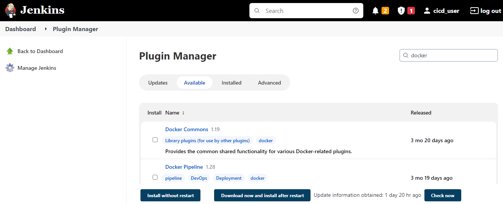
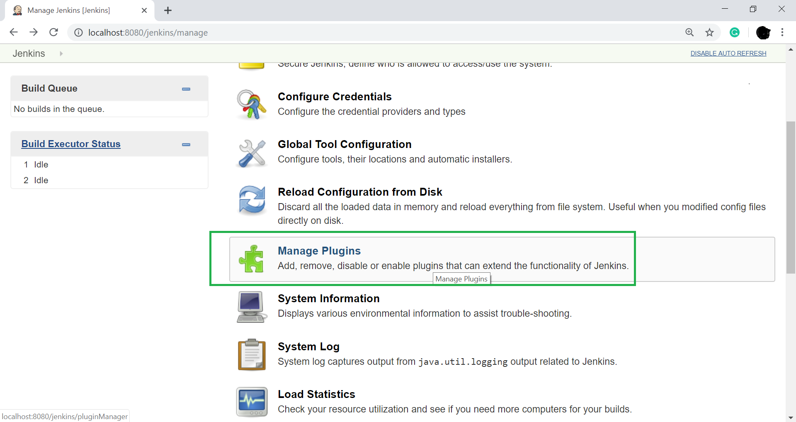

### Install all required plugins
  In Jenkins by default, we install all required plugins while installing Jenkins. If required any other plugins, we can install manually after configuring Jenkins by the below procedure. 

Example required plugins: 
 GitHub integrated plugin
 Docker plugin 
 JUnit Plugin 
Pipeline Utility Steps and etc.

There are two methods for installing plugins in Jenkins:

* Installing it through our Jenkins dashboard
* Downloading the plugin from Jenkins website and installing it
manually.

### Plugin manager
The Plugin Manager allows us to manage to enable and disable the plugins and to edit a plugin's details and options. It is also useful for quickly enabling/disabling multiple plugins. 

#### Installing it through our Jenkins dashboard
To install plugins first login into Jenkins under Jenkins Dashboard left side we have manage Jenkins options click on that then select manage plugins and under available section search for required plugin and select it then click on install without restart.

For example now we are trying to integrate the git plugin in Jenkins and find the steps below.

In the Home screen of the Jenkins (Jenkins Dashboard), click on the Manage Jenkins option on the left hand side of the screen.

* click on the Manage Plugins option.

* click on the "Available tab".

* The "Available" tab show us a list of plugins which are available for downloading. In Filter tab and enter the "Git Plugin" and select the plugin and Click on the "install without restart". 
We can also click on "Download now and install after restart" button in which the git plugin is installed after restart.

* To check Git plugin installed then go to "Installed" tab and check.

The procedure is same for all other required plugin installation.

#### Download the plugin from Jenkins website and installing it manually.

If any plugins we required to upgrade or downgrade first, we can download plugins from official plugins site in our local then upload it to Jenkins. Refer the site for [Downloadnewplugins](../../../TestingApplications.md).

**Note**: download plugins with .hpi extension only.

To upload plugins to Jenkins Goto, Manage Jenkins==>manage plugins==> under advance section ==>under deploy plugin click on choose file then upload earlier download plugin.

[<-Back to EnvironmentSetup](./EnvironmentSetup.md) - - - [Back to main TestingApplications](../../../TestingApplications.md) - - - [a head to MasterSlaveConfiguration->](./MasterSlaveConfiguration.md)