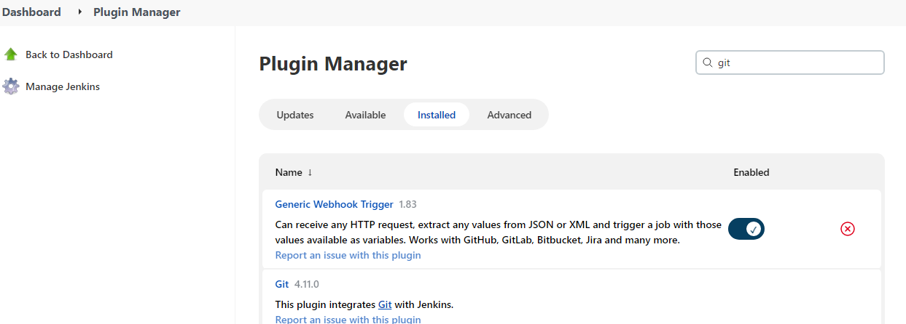

### Install Plugins
  In Jenkins by default, adminuser installs all required plugins while installing Jenkins. If required any other plugins, adminuser can install manually after configuring Jenkins by below procedure. 

### Plugin manager
The Plugin Manager allows to manage, enable and disable the plugins and to edit a plugin's details and options. 

There are two methods for installing plugins in Jenkins:

* Installing plugins through Jenkins dashboard
* Downloading the plugin from Jenkins website and installing it manually.

### Installing plugins through Jenkins dashboard
* To install plugins first login into Jenkins. 
* Under Jenkins Dashboard left side we have manage Jenkins options, click on it.
* Select manage plugins 
* Under available section search for required plugin and select it then click on install without restart. 

The procedure is applicable for other required plugin's installation in Jenkins. Below is one of the example plugin (GIT plugin) installation that required for SDN setup. 

In the Home screen of the Jenkins (Jenkins Dashboard), click on the Manage Jenkins.

* click on the Manage Plugins option.

* click on the "Available tab".

* The "Available" tab show us a list of plugins which are available for downloading. In Filter tab, enter "GIT Plugin" and select the plugin and Click on the "install without restart". 
We can also click on "Download now and install after restart" button in which the git plugin is installed after restart.

* To check Git plugin installed then go to "Installed" tab and check.

**Note** The procedure is same for all other required plugin installation.

#### Download the plugin from Jenkins website and installing it manually.

If any plugins we required to upgrade or downgrade first, we can download plugins from official plugins site in our local then upload it to Jenkins. Refer the site for [Downloadnewplugins](../../../TestingApplications.md).

**Note**: download plugins with .hpi extension only.

To upload plugins to Jenkins Goto, Manage Jenkins==>manage plugins==> under advance section ==>under deploy plugin click on choose file then upload earlier download plugin.

[<-Back to EnvironmentSetup](./EnvironmentSetup.md) - - - [Back to main TestingApplications](../../../TestingApplications.md) - - - [a head to ManageUsers and Access levels->](./ManageUsers.md)